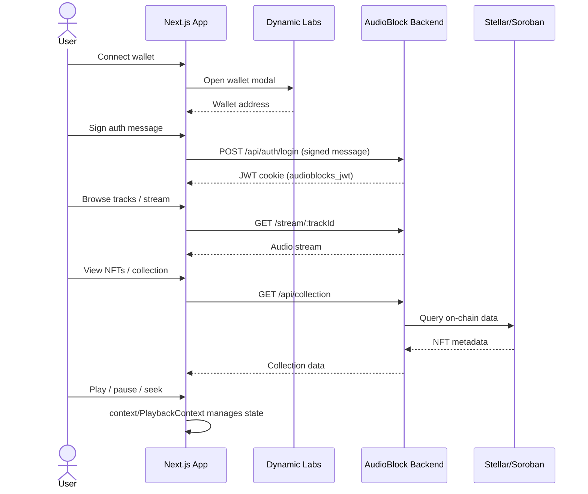

# AudioBlocks

AudioBlocks is a decentralized music platform built on Stellar/Soroban,
designed to make the music industry more transparent and equitable. Artists
tokenize their music as NFTs and earn royalties enforced by smart contracts
rather than intermediaries; listeners stream, discover, and collect that
music directly.

This repository is the **listener-facing** web app — discovery, streaming,
community, and the NFT marketplace experience. Artist-side tools (upload,
on-chain minting, earnings) live in the sibling
[`AudioBlocks_For_Artist`](https://github.com/AudioBitsStellar/AudioBlocks_For_Artist)
repo, and both talk to the shared
[`AudioBlock_Backend`](https://github.com/AudioBitsStellar/AudioBlock_Backend)
API.

## Table of Contents

- [Key Features](#key-features)
- [Tech Stack](#tech-stack)
- [Prerequisites](#prerequisites)
- [Architecture Overview](#architecture-overview)
- [Routes](#routes)
- [Authentication](#authentication)
- [Project Structure](#project-structure)
- [Environment Variables](#environment-variables)
- [Getting Started](#getting-started)
- [Scripts](#scripts)
- [Testing](#testing)
- [Accessibility](#accessibility)
- [Contributing](#contributing)
- [Known Gaps / In Progress](#known-gaps--in-progress)
- [Roadmap](#roadmap)

## Key Features

**For Listeners**

- Discover and stream music across categories, trending, and curated sections
- A built-in NFT marketplace for collecting tokenized music
- A community space with artist voting and listening-time leaderboards
- A personal collection view of owned music NFTs
- Persistent play-queue with shuffle, repeat, seek-with-preview, crossfade,
  gapless playback, and loudness-normalization controls .

**For Artists** (via the companion `AudioBlocks_For_Artist` app)

- Tokenized music with on-chain, transparently-enforced royalty splits
- Direct fan engagement, without payment intermediaries

## Tech Stack

| Concern         | Library                                                                        |
| --------------- | ------------------------------------------------------------------------------ |
| Framework       | Next.js 15 (App Router), React 19                                              |
| Language        | TypeScript (strict mode)                                                       |
| Styling         | Tailwind CSS 4, `tw-animate-css`                                               |
| UI primitives   | shadcn-style components on Radix UI (`components/ui/`)                         |
| Icons           | `lucide-react`, `react-icons` (Font Awesome, Heroicons)                        |
| Animation       | `framer-motion`                                                                |
| Carousels       | `react-slick`                                                                  |
| Toasts          | `sonner`                                                                       |
| Wallet (EVM)    | Dynamic Labs SDK, `wagmi`, `viem`                                              |
| Data fetching   | TanStack React Query (provisioned; see [Known Gaps](#known-gaps--in-progress)) |
| HTTP client     | `axios`                                                                        |
| Linting         | ESLint 9 + `eslint-plugin-jsx-a11y`                                            |
| Formatting      | Prettier                                                                       |
| Package manager | npm                                                                            |

## Prerequisites

Before setting up the project locally, ensure you have the following installed:

- **Node.js** — version 18.17 or later (the project uses Next.js 15 which requires Node 18.17+)
- **npm** — comes with Node.js (or use `pnpm` / `yarn` as an alternative)
- **A wallet extension** — [MetaMask](https://metamask.io/download/) or any EVM-compatible browser wallet (required for authentication via Dynamic Labs)
- **Git** — for cloning the repository

Optional but recommended:

- **The AudioBlock Backend** — running locally for full-featured development
  (clone from [`AudioBlock_Backend`](https://github.com/AudioBitsStellar/AudioBlock_Backend))

## Architecture Overview

The system is composed of three main services:

```mermaid
graph TB
    subgraph Frontend ["AudioBlocks Frontend (this repo)"]
        A[Next.js 15 App Router]
        A --> B[Public Pages<br/>app/\(home\)/]
        A --> C[Dashboard Pages<br/>app/dashboard/]
        B --> D[Marketing Site<br/>Hero, Discover, Features]
        C --> E[Streaming & Player<br/>context/PlaybackContext]
        C --> F[Community & Collection]
    end

    subgraph Services
        G[Dynamic Labs SDK<br/>Wallet Auth]
        H[AudioBlock Backend<br/>REST API]
        I[Blockchain<br/>Stellar / Soroban]
    end

    A --> G
    A --> H
    H --> I

    style Frontend fill:#1e1e2e,color:#fff
    style Services fill:#2d1b3d,color:#fff
```

### Data Flow



### Component Architecture

```mermaid
graph TD
    subgraph Layout Layer
        RootLayout[app/layout.tsx]
        HomeLayout[app/\(home\)/layout.tsx]
        DashLayout[app/dashboard/layout.tsx]
    end

    subgraph Providers
        Provider[context/provider.tsx]
        PlaybackCtx[context/PlaybackContext.tsx]
    end

    subgraph Shared UI
        Navbar[layouts/navbar]
        Footer[layouts/footer]
        Sidebar[components/common/dashboard/sidebar]
        TopNavbar[components/common/dashboard/topnavbar]
        Player[components/common/Player]
    end

    RootLayout --> Provider
    Provider --> HomeLayout
    Provider --> DashLayout
    DashLayout --> PlaybackCtx
    DashLayout --> Sidebar
    DashLayout --> TopNavbar
    DashLayout --> Player
    HomeLayout --> Navbar
    HomeLayout --> Footer
```

## Routes

### Public site — `app/(home)/`

| Route          | Description                                                                    |
| -------------- | ------------------------------------------------------------------------------ |
| `/`            | Landing page: hero, featured tracks, sound carousel, "how it works", discovery |
| `/artist-hub`  | Marketing page directing artists to the artist dashboard app                   |
| `/collective`  | Community page: collective overview, members, events, FAQ                      |
| `/marketPlace` | NFT marketplace demo                                                           |

### Authenticated app — `app/dashboard/` (requires `audioblocks_jwt` cookie)

| Route                        | Description                                              |
| ---------------------------- | -------------------------------------------------------- |
| `/dashboard`                 | Explore: categories, collections, events, artists, merch |
| `/dashboard/playlist`        | The listener's playlist                                  |
| `/dashboard/community`       | Artist voting and listening-hours leaderboard            |
| `/dashboard/collection`      | The listener's owned NFTs/assets                         |
| `/dashboard/profile`         | Listener profile                                         |
| `/dashboard/all-artists`     | Browse all artists                                       |
| `/dashboard/all-collections` | Browse all NFT collections                               |

`middleware.ts` gates every `/dashboard/*` route on the presence of the
`audioblocks_jwt` cookie, redirecting unauthenticated visitors to `/`.

## Authentication

Login is wallet-based via [Dynamic Labs](https://www.dynamic.xyz/):

1. A user connects or creates a wallet through Dynamic's embedded modal
2. The wallet signs a one-time message
3. The signature is sent to the backend's `/api/auth/login` (falling back to `/api/auth/register` for new users)
4. The returned JWT is stored in the `audioblocks_jwt` cookie
5. `middleware.ts` reads this cookie to gate authenticated routes

The auth flow is managed by `hooks/useAuth.tsx` with wallet connectors configured
in `context/provider.tsx` (Ethereum, email, and social login via Google).

Supported chains: `mainnet`, `sepolia`, `liskSepolia`.

## Project Structure

```
app/
├── (home)/                         # Public marketing / listener site
│   ├── layout.tsx                    # Navbar + Footer wrapper
│   ├── page.tsx                      # Landing page
│   ├── artist-hub/                   # Artist marketing page
│   ├── collective/                   # Community, members, events, FAQ
│   └── marketPlace/                  # NFT marketplace demo
├── dashboard/                       # Authenticated app
│   ├── layout.tsx                    # Sidebar + TopNavbar + Player wrapper
│   ├── page.tsx                      # Explore (categories, collections, events)
│   ├── all-artists/, all-collections/
│   ├── collection/, playlist/
│   ├── community/, profile/
│   └── profile/                      # Profile page + edit
├── global.css                       # Tailwind v4 theme + design tokens
└── layout.tsx                        # Root layout: fonts, Provider, skip-link

components/
├── ui/                              # shadcn / Radix primitives
│   ├── button.tsx, card.tsx, input.tsx
│   ├── sheet.tsx, sidebar.tsx       # Drawer + sidebar system
│   ├── tooltip.tsx, badge.tsx
│   ├── pagination.tsx, separator.tsx, skeleton.tsx
├── common/
│   ├── home/                         # Landing page sections
│   │   ├── Hero.tsx, Featured.tsx, Discover.tsx
│   │   ├── SoundSection.tsx, HowItWorks.tsx, Experience.tsx
│   │   ├── GoToTopButton.tsx, FullScreenLoader.tsx
│   ├── dashboard/                    # Dashboard sections
│   │   ├── sidebar/                   # Desktop sidebar + mobile Sheet drawer
│   │   ├── topnavbar/                 # Top bar: search, notifications, UserMenu
│   │   ├── Comment.tsx                # Comments slide-up panel
│   │   ├── Share.tsx                  # Share modal (Radix Dialog)
│   │   ├── AvatarCrop.tsx             # Avatar crop modal (Radix Dialog)
│   │   ├── CategorySection.tsx, Collections.tsx
│   │   ├── RecentlyPlayed.tsx, Merch.tsx, Artists.tsx
│   │   └── EventSection.tsx, carouselSettings.tsx
│   ├── artist-hub/, collective/      # Feature sections for public pages
│   ├── Player.tsx                    # Bottom audio player bar
│   ├── NftCollections.tsx            # NFT gallery
│   ├── WrongNetworkBanner.tsx        # Chain mismatch warning
│   └── SectionErrorBoundary.tsx, StakedCard.tsx

context/
├── PlaybackContext.tsx              # Audio player state (queue, play/pause, volume, shuffle)
└── provider.tsx                     # Dynamic Labs + Wagmi + React Query providers

hooks/
├── useAuth.tsx                      # Wallet-based auth login/register flow
├── use-mobile.ts                    # Mobile detection for responsive sidebar
├── queries/                         # TanStack React Query hooks
│   ├── collections.ts, tracks.ts, users.ts, index.ts
├── useCommunity.ts, useExplore.ts
├── useNFTCollection.ts, useProfile.ts, useSectionData.ts

lib/
├── apiClient.ts                     # Axios instance with JWT interceptor
├── env.ts                           # Runtime env validation (NEXT_PUBLIC_API_URL)
├── utils.ts                         # shadcn cn() helper
├── communityService.ts, exploreService.ts, profileService.ts

layouts/
├── navbar/                          # Public site nav (desktop links + mobile slide-in menu)
└── footer/                          # Public site footer

config/
└── abi.tsx                          # Contract ABI / address (scaffolding — see Known Gaps)

middleware.ts                        # JWT route gate for /dashboard/*
public/                              # Static assets (images, icons, placeholders)
```

## Environment Variables

All environment variables are prefixed `NEXT_PUBLIC_` (client-accessible).

| Variable               | Required | Default                     | Description                                                  |
| ---------------------- | -------- | --------------------------- | ------------------------------------------------------------ |
| `NEXT_PUBLIC_API_URL`  | Yes      | `http://localhost:4000/api` | Base URL of the AudioBlock Backend REST API                  |
| `NEXT_PUBLIC_SITE_URL` | No       | `http://localhost:3000`     | Canonical site URL (used for metadata / SEO)                 |
| `ANALYZE`              | No       | —                           | Set to `true` to run the bundle analyzer during `next build` |

Variables are validated at runtime by `lib/env.ts`. If `NEXT_PUBLIC_API_URL` is
missing, the app logs an error and throws.

## Getting Started

### 1. Clone the repository

```bash
git clone https://github.com/AudioBitsStellar/AudioBlocks_Frontend_v1.git
cd AudioBlocks_Frontend_v1
```

### 2. Install dependencies

```bash
npm install
```

### 3. Set up environment variables

```bash
cp .env.example .env.local
```

Or create the file manually:

```bash
echo "NEXT_PUBLIC_API_URL=http://localhost:4000/api" > .env.local
```

### 4. (Optional) Run the backend

Clone and start the [AudioBlock Backend](https://github.com/AudioBitsStellar/AudioBlock_Backend)
to enable authentication and streaming. Without it, the app renders static demo data.

### 5. Start the development server

```bash
npm run dev
```

Open [http://localhost:3000](http://localhost:3000) in your browser.

### 6. Connect a wallet

Install [MetaMask](https://metamask.io/download/) (or any EVM wallet),
then click **Sign in** in the navbar and follow the Dynamic Labs flow.

## Scripts

| Command                 | Description                                                   |
| ----------------------- | ------------------------------------------------------------- |
| `npm run dev`           | Starts the Next.js development server (port 3000)             |
| `npm run build`         | Production build with TypeScript checking                     |
| `npm start`             | Serves the production build                                   |
| `npm run lint`          | Runs ESLint across all files (includes jsx-a11y rules)        |
| `npm test`              | Runs the Vitest test suite                                    |
| `npm run test:coverage` | Runs unit tests with code coverage analysis                   |
| `npm run audit`         | Scans project dependencies for vulnerabilities                |
| `npm run audit:check`   | Scans dependencies and fails on high/critical vulnerabilities |
| `npm run format`        | Formats the codebase with Prettier                            |

### Prettier configuration (`.prettierrc`)

- Single quotes
- Semicolons
- 100-character print width
- ES5 trailing commas

## Testing

The project uses Vitest and React Testing Library for unit/integration tests and Playwright for E2E tests:

```bash
# Run unit and integration tests
npm test

# Run tests with coverage reporting
npm run test:coverage
```

### Manual testing checklist

- **Authentication flow**: Connect wallet, sign message, verify redirect to dashboard
- **Audio player**: Play, pause, seek, volume, prev/next, shuffle, repeat
- **Navigation**: All routes load without 404 errors
- **Responsive**: Layouts adapt correctly at mobile/tablet/desktop breakpoints
- **Error states**: Network errors show appropriate UI feedback

### Accessibility testing

The project enforces accessibility via:

- **ESLint rule**: `eslint-plugin-jsx-a11y` (recommended ruleset enabled)
- **Focus management**: All modals and slide-in panels have focus trapping (Tab/Shift+Tab cycles within the panel, Escape closes)
- **Skip link**: A "Skip to main content" link is rendered at the top of every page
- **ARIA attributes**: All interactive controls have appropriate `aria-label`, `role`, and state attributes
- **Tools**: Test with [axe DevTools](https://www.deque.com/axe/) browser extension, screen readers (VoiceOver on macOS, NVDA on Windows)

## Accessibility

The following accessibility features are implemented across the app:

| Feature                         | Status                                                    |
| ------------------------------- | --------------------------------------------------------- |
| Skip link to main content       | ✅ `app/layout.tsx`                                       |
| Visible focus indicators        | ✅ `*:focus-visible` in `globals.css`                     |
| ARIA labels on buttons          | ✅ Player controls, nav buttons, modals                   |
| `role="slider"` on seek/volume  | ✅ `components/common/Player.tsx`                         |
| `aria-live` track announcements | ✅ Player announces "Now playing: Title by Artist"        |
| Seek preview tooltip            | ✅ Player scrubber shows target time while hovering/seeking |
| Focus trapping in modals        | ✅ Comment panel, UserMenu, mobile nav, Share, AvatarCrop |
| Keyboard-accessible lists       | ✅ Recently Played cards                                  |
| `eslint-plugin-jsx-a11y`        | ✅ Recommended ruleset                                    |

## Contributing

We welcome contributions! Please follow these guidelines.

### Pull Request Process

1. **Fork** the repository and create a feature branch from `main`:

   ```bash
   git checkout -b feature/your-feature-name
   ```

2. **Make your changes**, keeping scope focused. Follow existing code conventions
   (see [Tech Stack](#tech-stack)).

3. **Run linting** before committing:

   ```bash
   npm run lint
   npm run format
   ```

4. **Write meaningful commit messages** — use conventional commits format:

   ```
   feat: add profile page layout
   fix: correct seek-bar time display
   a11y: add aria-labels to player controls
   chore: update dependencies
   ```

5. **Open a Pull Request** against `main` with a clear description:
   - What the change does
   - Why it's needed
   - Screenshots (for UI changes)
   - Any manual testing performed

### Code Style Guidelines

- **TypeScript**: Strict mode enabled — avoid `any` and `@ts-ignore` where possible
- **Components**: Prefer function components with hooks; use `memo` for render-heavy components
- **Imports**: Group third-party imports first, then local imports (the project does not enforce this automatically yet)
- **CSS**: Use Tailwind utility classes; avoid custom CSS unless necessary
- **Accessibility**: All interactive elements must have ARIA labels and keyboard support — new components should pass jsx-a11y lint rules
- **State management**: Use React context for global state (`PlaybackContext`), local state for component-specific state

### Reporting Issues

Open a GitHub issue with:

- A clear, descriptive title
- Steps to reproduce (for bugs)
- Expected vs. actual behavior
- Screenshots or screen recordings (if applicable)
- Environment details (browser, OS, wallet)

## Known Gaps / In Progress

- Most dashboard and discovery pages (Explore, Playlist, Community,
  Collection, Marketplace) currently render static/dummy data rather than
  live data from the backend or chain.
- `config/abi.tsx` defines a contract address and ABI that aren't currently
  referenced anywhere in the app — scaffolding for a future direct on-chain
  read/write feature.
- `@tanstack/react-query` is wired into the provider tree (required
  internally by `wagmi`) but isn't yet used for the app's own data fetching.
- Automated test suite is not yet implemented.
- Dynamic Labs `environmentId` is hardcoded in `context/provider.tsx` and
  should be moved to an environment variable.

## Roadmap

1. **Phase 1** — MVP launch with music streaming and basic reward functionality
2. **Phase 2** — Advanced analytics for artists and personalized recommendations for listeners
3. **Phase 3** — Expand platform integrations with other Web3 ecosystems
4. **Phase 4** — Scale to a global audience with enhanced performance optimization

## Pre-commit Hooks

This project uses Husky and lint-staged to enforce code quality before commits.

### What Gets Checked

When you commit code, the following checks run automatically on staged files:

1. **ESLint** - Automatically fixes linting issues where possible
2. **Prettier** - Formats code according to project standards
3. **TypeScript Type Checking** - Validates types across the entire project

### Setup

The hooks are automatically installed when you run:

```bash
npm install
```

### Manual Trigger

To manually run the pre-commit checks without committing:

```bash
npx lint-staged  # Run linting and formatting on staged files
npx tsc --noEmit # Run TypeScript type checking
```

### Skipping Hooks (Not Recommended) .

If you absolutely need to skip the hooks (not recommended):

```bash
git commit --no-verify -m "your message"
```

**Note:** Commits that bypass hooks may fail CI checks and be rejected during code review.

Fixing issue 72

Fixing issue 72
.
